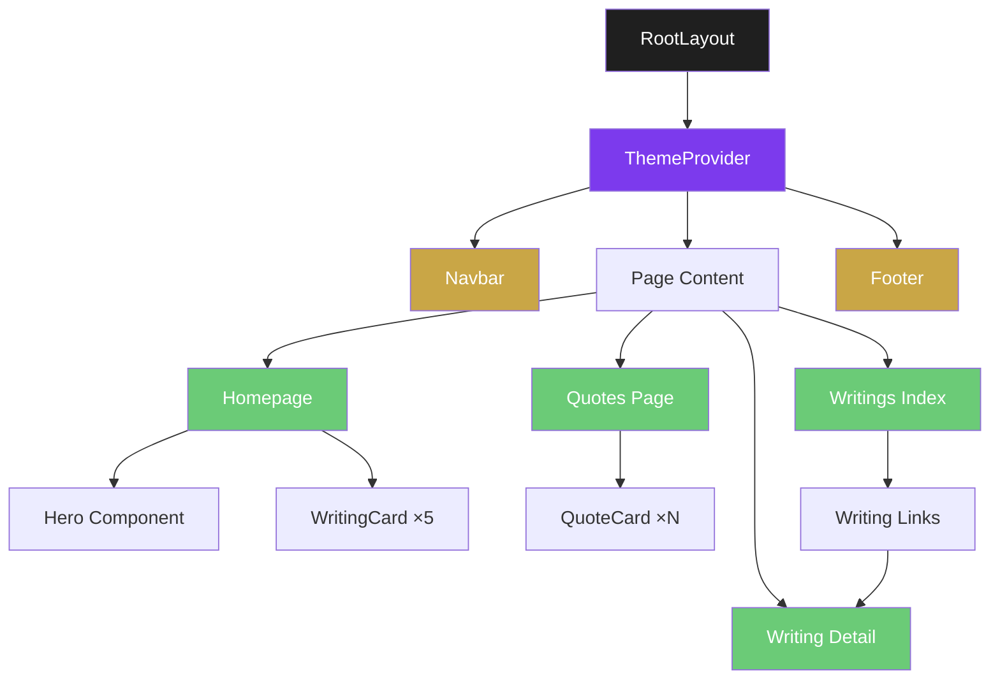
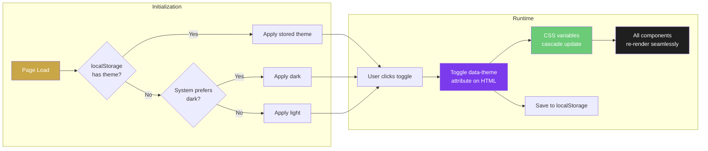
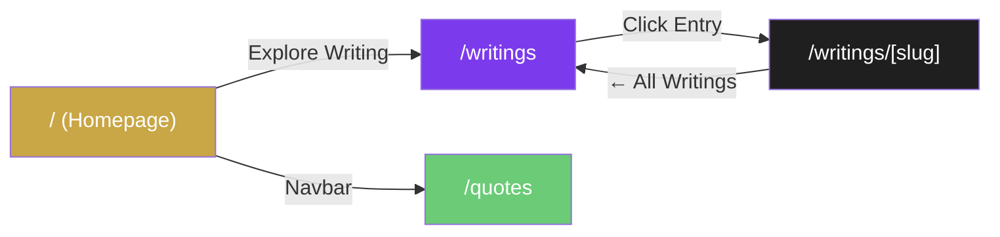
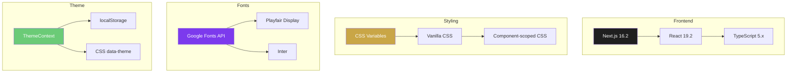

<p align="center">
  
  
  
  
</p>

<h1 align="center">✦ Words & Silence ✦</h1>

<p align="center">
  <em>A minimalist sanctuary for personal writings, reflections, and quiet thoughts.</em>
</p>

<p align="center">
  <strong>Where thoughts find their quiet sanctuary.</strong>
</p>

---

## 📖 About

**Words & Silence** is a premium, minimalist personal writing platform designed for publishing intimate reflections, quotes, and poetic fragments. Built with a focus on emotional calmness and typographic elegance, it provides a distraction-free reading experience that puts the words — and the silence between them — at the center of everything.

> *"A minimalist collection of poetry, quotes, and short reflections."*

---

## ✨ Features

| Feature | Description |
|---------|-------------|
| **📝 Writings Collection** | Full-length reflective pieces with individual detail pages |
| **💬 Quotes Sanctuary** | Curated short-form thoughts displayed in elegant card grids |
| **🌙 Dark Mode** | Sophisticated dark theme with smooth transitions and localStorage persistence |
| **🎨 Tri-Color Design** | Unified Gold, Purple & Green accent system across all pages |
| **📱 Responsive Design** | Fluid layouts that adapt beautifully from mobile to desktop |
| **⚡ SSR + Static** | Server-side rendering with static generation for individual writings |
| **🔤 Premium Typography** | Playfair Display (serif) + Inter (sans-serif) font pairing |

---

## 🏗️ Architecture

### System Overview



### Project Structure

```
Words-Sanctuary/
├── src/
│   └── app/
│       ├── components/         # Reusable UI components
│       │   ├── Navbar.tsx      # Navigation with dark mode toggle
│       │   ├── Navbar.css
│       │   ├── Hero.tsx        # Full-screen landing hero
│       │   ├── Hero.css
│       │   ├── QuoteCard.tsx   # Individual quote display
│       │   ├── QuoteCard.css
│       │   ├── WritingCard.tsx # Writing preview card
│       │   ├── WritingCard.css
│       │   ├── Footer.tsx      # Site footer with socials
│       │   └── Footer.css
│       ├── context/
│       │   └── ThemeContext.tsx # Dark/Light theme state management
│       ├── quotes/
│       │   ├── data.ts         # Quotes data store
│       │   ├── page.tsx        # Quotes listing page
│       │   └── quotes.css
│       ├── writings/
│       │   ├── data.ts         # Writings data store
│       │   ├── page.tsx        # Writings index page
│       │   ├── writings.css
│       │   └── [slug]/
│       │       └── page.tsx    # Individual writing detail page
│       ├── globals.css         # Design tokens & theme variables
│       ├── layout.tsx          # Root layout with providers
│       └── page.tsx            # Homepage
├── package.json
├── tsconfig.json
├── next.config.ts
└── README.md
```

### Theme Architecture



---

## 🎨 Design System

### Color Palette

| Token | Light Mode | Dark Mode | Usage |
|-------|-----------|-----------|-------|
| `--primary-bg` | `#ffffff` | `#0c0d10` | Page background |
| `--secondary-bg` | `#fafaf7` | `#111318` | Section backgrounds |
| `--surface-bg` | `#ffffff` | `#16191f` | Card surfaces |
| `--text-primary` | `#1f1f1f` | `#e2e8f0` | Headings & body text |
| `--text-muted` | `#5c5c5c` | `#718096` | Secondary text |
| `--accent-gold` | `#c9a646` | `#d4b964` | Primary accent |
| `--accent-purple` | `#7c3aed` | `#a78bfa` | Interactive accent |
| `--accent-green` | `#6bcb77` | `#6bcb77` | Tertiary accent |

### Typography

| Role | Font | Weight |
|------|------|--------|
| Headings | Playfair Display | 500 |
| Body | Inter | 400 |
| UI Elements | Inter | 500 |

---

## 🚀 Getting Started

### Prerequisites

- **Node.js** 18.x or higher
- **npm** 9.x or higher

### Installation

```bash
# Clone the repository
git clone https://github.com/AyushSingh360/Words-Sanctuary.git
cd Words-Sanctuary

# Install dependencies
npm install

# Start the development server
npm run dev
```

The application will be available at **[http://localhost:3000](http://localhost:3000)**.

### Build for Production

```bash
# Create optimized production build
npm run build

# Start production server
npm start
```

---

## 📄 Content Management

### Adding a New Writing

Add entries to `src/app/writings/data.ts`:

```typescript
{
  slug: 'your-writing-slug',
  title: 'Your Writing Title',
  date: 'April 15, 2026',
  excerpt: 'A brief preview of the writing...',
  paragraphs: [
    'First paragraph of your writing.',
    'Second paragraph continues here.',
  ],
  signature: '~ash',
}
```

### Adding a New Quote

Add entries to `src/app/quotes/data.ts`:

```typescript
{
  id: 6,
  content: "Your quote text here.",
  author: "ash",
  category: "Reflection"
}
```

---

## 📊 Page Routing



| Route | Description | Rendering |
|-------|-------------|-----------|
| `/` | Homepage with Hero + Selected Fragments | Client-side |
| `/quotes` | Full quotes collection in card grid | Client-side |
| `/writings` | Writings index with all entries | Server-side |
| `/writings/[slug]` | Individual writing detail page | Static (SSG) |

---

## 🛠️ Tech Stack



---

## 🌐 Deployment

### Vercel (Recommended)

1. Push your repository to GitHub
2. Import the project on [Vercel](https://vercel.com/new)
3. Vercel auto-detects Next.js — click **Deploy**

### Other Platforms

```bash
npm run build    # Creates .next/ production bundle
npm start        # Starts Node.js production server on port 3000
```

---

## 📁 Current Content

### Writings (8 entries)
- *A Letter to Someone*
- *Tulips in Every Season*
- *You Know You're in Love*
- *I Hope Attachments Never Find Me Again*
- *The Bare Minimum*
- *If Loving Me...*
- *Scared of Losing You*
- *Was Leaving the Only Option?*

### Quotes (5 entries)
- *"Maybe the worst part isn't losing people..."*
- *"The moment you are disturbed by an insult..."*
- *"Maybe one day, you will understand..."*
- *"Those who do not know how to lie..."*
- *"Maybe in another universe..."*

---

## 📜 License

This project is open-source and available under the [MIT License](LICENSE).

---

<p align="center">
  <em>Built with quiet intention by <strong>~ash</strong></em>
</p>

<p align="center">
  ✦
</p>
